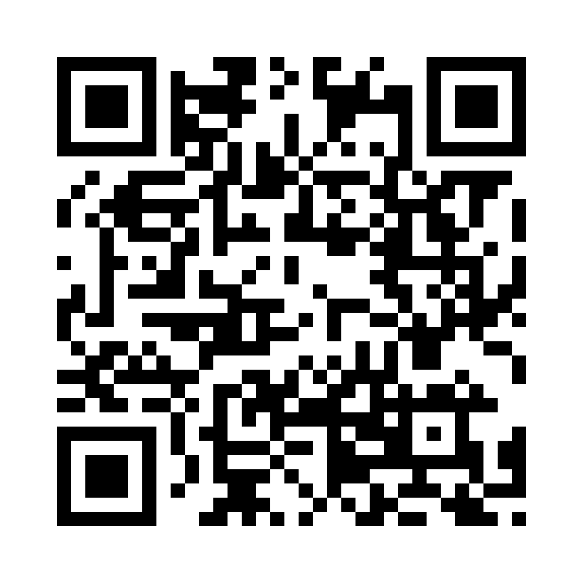

<p align="center">
  <a href="./README.md">English</a> · Español
</p>

<p align="center">
  <a href="https://cybergems.org/apps/cybernotes/">
    
  </a>
</p>

<p align="center">
  <a href="https://github.com/CyberGems/CyberNotes/releases/latest"></a>
  &nbsp;<a href="https://github.com/CyberGems/CyberNotes/releases"></a>
</p>

<p align="center">
  &nbsp;
  &nbsp;
  &nbsp;
  <a href="https://github.com/CyberGems/CyberNotes/wiki"></a>
</p>

---

## ¿Qué es CyberNotes?

CyberNotes es una aplicación de toma de notas elegante y centrada en la privacidad para Windows que mantiene la escritura y la organización completamente en tu equipo. Crea notas enriquecidas con formato, imágenes, bloques de código y atajos de markdown; organízalas en carpetas de colores; trabaja con varias pestañas; y separa notas importantes en ventanas flotantes. La búsqueda instantánea, el guardado automático, la restauración de sesión, temas personalizables y un bloqueo de acceso opcional con contraseña maestra sostienen tanto las ideas rápidas como los proyectos largos. Los datos se guardan localmente con **SQL.js (SQLite WASM)**. Construido con **Electron + React + TypeScript**.

*Gratuito y de código abierto (GPLv3): sin anuncios, sin rastreo y sin recogida de datos. Solo disfrútalo.*

---

## 🔒 ¿Por qué CyberNotes?

La mayoría de las apps de notas sincronizan tus datos en la nube (riesgo de privacidad) o son demasiado básicas para ser útiles. CyberNotes te da **lo mejor de ambos mundos**: edición enriquecida, organización potente y seguridad de hierro, todo 100 % sin conexión.

| Necesidad | Solución |
|---|---|
| Mantener las notas privadas | SQL.js solo local: sin nube, sin cuentas, sin rastreo |
| Edición enriquecida sin bloat | Editor TipTap con atajos de markdown, imágenes y bloques de código |
| Mantente organizado | Carpetas con iconos y colores, varias pestañas, notas flotantes, arrastrar y soltar |
| Proteger notas sensibles | Contraseña maestra (bloqueo de acceso con hash bcrypt, notas almacenadas sin cifrar) con bloqueo automático y escudo de privacidad |
| Trabajar eficientemente | Guardado automático, restauración de sesión, atajo global, bandeja del sistema |
| Hazlo tuyo | 6 temas, fondos personalizados, efectos de cristal, escalado de la interfaz |

---

## ✨ Funciones principales

### ✍️ Edición de texto enriquecido
- **Editor TipTap**: negrita, cursiva, subrayado, tachado, encabezados (H1–H3), listas con viñetas y numeradas, bloques de código, citas, reglas horizontales y resaltado de texto
- **Tamaños de fuente al estilo Word**: desplegable de tamaño y burbuja flotante en el editor, ciclado con un toque en las notas flotantes
- **Enlaces e imágenes**: detección automática de enlaces, inserción de imágenes con controles de tamaño y alineación, vistas previas en miniatura locales
- **Atajos de Markdown**: escribe `##`, `>`, `-`, `` ``` `` para formatear al instante
- **Herramientas de documento**: contador de líneas y columnas, recuento de palabras y caracteres, tiempo de lectura, minimapa, números de línea e indicadores de continuación
- **Mapa de caracteres y emojis**: busca símbolos Unicode y emojis 18.0 por categoría; inserta uno o reúne varios a la vez
- **Estado de guardado**: estados de guardado, guardando, pendiente y error con hora en el editor y las notas flotantes
- **Opciones de guardado**: guardado automático al escribir, guardado manual con protección de borrador y confirmación al cerrar o navegar

### 📁 Organización
- **Carpetas**: nombres personalizados, 20 opciones de icono y 20 colores únicos (unicidad garantizada)
- **Notas flotantes**: separa las notas como widgets adhesivos siempre visibles; recorre acciones ocultas de la barra con la rueda del mouse
- **Interfaz de varias pestañas**: trabaja con varias notas a la vez
- **Espacio compacto**: contrae la barra lateral o la columna de números de línea para dar más espacio a la edición
- **Favoritos y anclaje**: fija notas importantes para acceso rápido
- **Arrastrar y soltar**: mueve notas entre carpetas sin esfuerzo
- **Búsqueda instantánea**: búsqueda de texto completo en títulos, vistas previas y contenido
- **Notas recientes**: registra las notas editadas, abiertas y creadas con historial
- **Espacio de bienvenida**: saludo según la hora, estadísticas de notas y atajos de teclado cuando no hay ninguna nota abierta
- **Restauración de sesión**: recuerda las pestañas abiertas, la nota activa y las notas flotantes entre sesiones

### 🔐 Seguridad
- **Contraseña maestra o PIN**: bloqueo de acceso con hash bcrypt y pantalla de bloqueo (las notas se almacenan sin cifrar en tu equipo)
- **Recuperación sin conexión**: código de recuperación de un solo uso con pista y restablecimiento limitado por tasa desde la pantalla de bloqueo
- **Bloqueo automático**: tiempo de inactividad configurable (1 minuto a 24 horas)
- **Escudo de privacidad**: escudo de pantalla cuando la app está oculta o minimizada
- **Gestor de Bloc Mayús**: apagado automático tras la inactividad con cuenta regresiva temática en la barra y aviso cerrable, además de sonidos (5 preajustes sintetizados)

### 🎨 Personalización
- **6 temas visuales**: CyberNotes (oscuro), Cian Medianoche, Verde Bosque, Magenta Neón, Blanco Claro y Gris Grafito
- **Intensidad de color**: ajustable del 0 al 100 % para los temas coloridos
- **Fondo personalizado**: define tu propia imagen de fondo
- **Efectos de cristal**: intensidad de desenfoque configurable (0–40 px) y opacidad de superposición (0–95 %)
- **Escalado de la interfaz**: ajusta el tamaño de la interfaz a tu gusto
- **Anchura de pestañas**: normal o ancha, conmutador de minimapa y controles de densidad
- **Nombre de saludo**: personaliza los saludos según la hora
- **Diseños adaptables**: menús que se ajustan a la pantalla, barra superior y pie del editor para ventanas angostas

### 🖥️ Integración con escritorio
- **Bandeja del sistema**: minimizar o cerrar a la bandeja, menú de bandeja personalizado consciente de DPI
- **Atajo global**: mostrar u ocultar con atajo personalizable (predeterminado: `Alt+Shift+N`)
- **Recomendaciones de la suite**: más de CyberGems en Acerca de y en la bandeja (opcional)
- **Inicio automático**: inicia minimizado con Windows
- **Instancia única**: un segundo lanzamiento enfoca la ventana existente
- **Corrector ortográfico**: bilingüe (inglés/español) con sugerencias al hacer clic derecho
- **Menú contextual**: formato, sugerencias del corrector y controles de enlace e imagen

### 🔄 Actualizaciones y datos
- **Actualizaciones automáticas**: comprobación en segundo plano al iniciar y cada 6 h, barra de progreso, descarga automática y reinicio
- **Las comprobaciones manuales siguen siendo manuales**: las comprobaciones bajo demanda solo comprueban; las descargas y los reinicios requieren tu confirmación
- **Estadísticas de uso**: estadísticas locales opcionales con rachas, restablecimiento y purga
- **Exportación**: Markdown, HTML (con estilo) o copia de seguridad JSON completa
- **Importación**: restaura desde una copia JSON (con copia de seguridad automática)
- **Interfaz bilingüe**: inglés y español completos con cambio instantáneo
---

## 🚀 Primeros pasos

### Instalación (recomendada)

1. Descarga el instalador más reciente o la build portable desde [Releases](https://github.com/CyberGems/CyberNotes/releases/latest)
2. Ejecuta el instalador `CyberNotes_Setup` o el ejecutable portable
3. Inicia CyberNotes. No necesitas ningún otro requisito: **no** necesitas Node.js ni npm

### 🛡️ Windows SmartScreen

Windows puede mostrar un aviso de SmartScreen la primera vez que ejecutas el instalador de CyberNotes: esta es una app de hobby sin firmar, así que Windows aún no ha construido reputación para el archivo. Esto es esperado; el código fuente es público para que puedas inspeccionar exactamente qué hace. Lo mismo puede ocurrir al lanzar la versión portable.

Para continuar:

<details>
<summary><strong>Cómo ejecutar el instalador (paso a paso)</strong></summary>

Windows muestra este aviso para cualquier instalador sin un certificado de firma de código de pago; no significa que el archivo sea inseguro. No hagas clic en "No ejecutar":

1. Ejecuta el instalador. Windows puede mostrar el diálogo azul "Windows protegió tu PC".


2. Haz clic en el pequeño enlace **Más información**.


3. Haz clic en **Ejecutar de todos modos**. El instalador arranca con normalidad.

Puedes verificar el archivo de forma independiente: compara el SHA con el release de GitHub, escanéalo en VirusTotal o compila desde el código fuente. Más detalles: [guía de SmartScreen en el sitio web](https://cybergems.org/download#smartscreen).

</details>
---

## 🛠️ Stack tecnológico y arquitectura

- **Plataforma:** Windows 10 / 11
- **Framework:** Electron 35 + React 19 + TypeScript
- **Editor:** TipTap (ProseMirror)
- **Almacenamiento:** SQL.js (SQLite compilado a WebAssembly)
- **Seguridad:** hash de contraseña con bcryptjs
- **Animaciones:** Motion (Framer Motion)
- **Pruebas:** tests unitarios con Vitest (`npm test`)

```
cyber-notes/
├── electron/
│   ├── main.ts           Proceso principal de Electron (ventana, bandeja, adhesivos, manejadores IPC)
│   ├── preload.ts        Puente de contexto (exposición segura de la API)
│   ├── updater.ts        Lógica de actualización automática
│   ├── logger.ts         Registro en archivo (userData/logs)
│   └── OpenTaskbarSettings.cs  Código auxiliar para la herramienta de anclado a la bandeja
├── shared/               Código compartido por main y renderer (sin APIs de Electron/React)
│   ├── notes.ts          Extracción de miniaturas
│   ├── sticky.ts         Paleta e ids de notas flotantes
│   ├── lang.ts           Ayudantes de idioma
│   └── backup.ts         Lógica de copia de seguridad automática (más suites *.test.ts)
├── src/
│   ├── components/
│   │   ├── MainApp.tsx         Distribución principal de la aplicación
│   │   ├── TitleBar.tsx        Barra de título personalizada con menú y saludo
│   │   ├── Sidebar.tsx         Navegación de carpetas y notas recientes
│   │   ├── NoteList.tsx        Panel de lista de notas con búsqueda y papelera
│   │   ├── NoteEditor.tsx      Editor TipTap, pestañas y exportación
│   │   ├── StickyNoteApp.tsx   Widget de nota flotante siempre visible
│   │   ├── SettingsModal.tsx   Configuración con copia de seguridad
│   │   ├── LockScreen.tsx      Pantalla de bloqueo por contraseña
│   │   ├── AboutModal.tsx      Diálogo Acerca de y estado de actualizaciones
│   │   ├── UpdaterBanner.tsx   Banner de progreso de actualización automática
│   │   ├── TrayPinModal.tsx    Diálogo auxiliar de anclado a la bandeja
│   │   ├── AppLoader.tsx       Cargador de inicio y escudo de privacidad
│   │   ├── WelcomeGreeting.tsx Saludo según la hora con fecha
│   │   ├── WelcomeNameModal.tsx Configuración inicial del nombre
│   │   ├── FolderIcon.tsx      Iconos y colores de carpetas
│   │   ├── ConfirmDialog.tsx   Diálogos de confirmación/alerta reutilizables
│   │   ├── ModalActions.tsx    Movimiento y ayudantes compartidos de ventanas
│   │   ├── Tooltip.tsx         Tooltips personalizados
│   │   ├── ErrorBoundary.tsx   Respaldo ante fallos de renderizado
│   │   └── GlobalErrorToast.tsx Aviso global de errores
│   ├── hooks/
│   │   └── useInputContextMenu.tsx Menús contextuales nativos en campos de entrada
│   ├── utils/
│   │   ├── notes.ts      Ayudantes de metadatos, vista previa y miniaturas de notas
│   │   └── audio.ts      Sonidos sintetizados de Bloc Mayús
│   ├── types/             Interfaces TypeScript y tipos del puente de API
│   ├── themes.ts          Definiciones de temas
│   ├── fonts.ts           Fuentes del editor
│   └── languages.ts       Traducciones i18n (inglés / español)
├── public/
│   ├── tray-menu.html/.js/.css  Ventana de menú de bandeja personalizada
│   └── fonts/            Fuentes autoalojadas (totalmente sin conexión)
└── package.json
```

### Compilar desde el código fuente (desarrolladores)

Solo necesario si quieres modificar CyberNotes o compilarlo tú mismo; los usuarios normales pueden omitir esta sección.

#### Requisitos previos

- [Node.js](https://nodejs.org/) v18+ (recomendado LTS)
- npm o yarn

#### Desarrollo

```bash
git clone https://github.com/CyberGems/CyberNotes.git
cd CyberNotes
npm install
npm run dev
```

#### Compilación para producción

```bash
npm run build:electron
```

#### Scripts disponibles

| Comando | Descripción |
|---------|-------------|
| `npm run dev` | Inicia el servidor de desarrollo de Vite con recarga en vivo |
| `npm run build` | Compila TypeScript y construye el paquete de producción |
| `npm run build:electron` | Build completo: TypeScript → Vite → instalador electron-builder |
| `npm run preview` | Vista previa local del build de producción |
| `npm run lint` | Comprobación de tipos de TypeScript sin emitir archivos |
| `npm test` | Ejecuta los tests unitarios con Vitest |

#### Distribución

Los artefactos quedan en `release/`:

| Artefacto | Descripción |
|---|---|
| `CyberNotes_Setup_1.16.0.exe` | Instalador NSIS (asistente interactivo, directorio de instalación personalizado) |
| `CyberNotes_Portable_1.16.0.exe` | Build portable (sin instalación) |
---

## ⌨️ Atajos de teclado

| Tecla | Acción |
|---|---|
| `Alt+Shift+N` | Alternar visibilidad de la ventana (global, personalizable) |
| `Ctrl+N` | Crear una nota nueva |
| `Ctrl+Shift+N` | Crear una carpeta nueva |
| `Ctrl+F` | Enfocar la barra de búsqueda |
| `Ctrl+S` | Guardar la nota manualmente |
| `Mayús+F3` | Alternar entre modo oración, minúsculas, MAYÚSCULAS, Capitalizar y alternar mayúsculas |
| `↑` / `↓` | Navegar por las notas de la lista |
| `Intro` | Abrir la nota seleccionada en el editor |
| `Escape` | Devolver el foco a la lista de notas / cerrar la ventana |
| `Ctrl+Z` / `Ctrl+Y` | Deshacer / rehacer |
| `Tab` / `Mayús+Tab` | Indentar / quitar sangría |

Para la referencia completa de atajos, incluida la navegación del cursor, los saltos de línea y las teclas de selección de texto, consulta la [wiki de Atajos de teclado](https://github.com/CyberGems/CyberNotes/wiki/Keyboard-Shortcuts).

---

## ❤️ Donar

Tras incontables horas construyendo y perfeccionando **CyberNotes** para mi propio uso, decidí recientemente compartirlo con el mundo junto a mis otras herramientas de código abierto en [CyberGems](https://github.com/CyberGems#-all-apps--repositories).

Si te gustaría apoyar las futuras actualizaciones, te lo agradecería de verdad. Tu donación ayuda a mantener el desarrollo, lanzar nuevas funciones, acelerar la resolución de actualizaciones y errores, y mejorar la calidad de la documentación. También puedes mostrar tu apoyo [poniendo una estrella al repo en GitHub](https://github.com/CyberGems/CyberNotes). ¡Gracias! 🙏

<p align="center">
  <a href="https://www.paypal.com/donate/?hosted_button_id=M4PY3UPJA5Y6Q"></a>
</p>

<p align="center">
  <a href="https://ko-fi.com/cybergems"></a>
</p>

<p align="center">
  <a href="https://buymeacoffee.com/cybergems"></a>
</p>

<div align="center">

<details>
<summary><b>Donaciones cripto (BTC, ETH, USDT, LTC): haz clic para ver las direcciones</b></summary>

| Activo | Dirección | QR |
|---|---|---|
| **BTC** | <pre><code>bc1q5mxzz05nmvsheqzx7970euswta3fksxzcfzag4</code></pre> |  |
| **ETH** | <pre><code>0x79b703Ec0f77493679Fcd280aF3b983E20c580B8</code></pre> |  |
| **USDT (ERC20 / BEP20)** | <pre><code>0x79b703Ec0f77493679Fcd280aF3b983E20c580B8</code></pre> |  |
| **USDT (TRC20)** | <pre><code>TSVbSk1HSyZ1NprCnAYiw56ECwXgH887mD</code></pre> |  |
| **LTC** | <pre><code>LWGnEHgcFCE2BRkzLnsdPDD8Y8ZeDK577X</code></pre> |  |

> ⚠️ Envía solo el activo seleccionado en la red indicada. Usar la red incorrecta provocará la pérdida permanente de fondos.

</details>

</div>

---

## 📄 Licencia

CyberNotes se distribuye bajo los términos de la Licencia Pública General GNU v3.0. Consulta [LICENSE](LICENSE) para el texto completo de la licencia.

Copyright (C) 2026 CyberGems

---

## ❓ Preguntas frecuentes

Para preguntas frecuentes, guías de solución de problemas e instrucciones detalladas de configuración, visita las [Preguntas frecuentes](https://github.com/CyberGems/CyberNotes/wiki/FAQ) o la [documentación en línea](https://cybergems.org/docs/cybernotes/FAQ).

> Fuente de verdad de la documentación: la [wiki de GitHub](https://github.com/CyberGems/CyberNotes/wiki) es la canónica (editada desde el checkout `CyberNotes.wiki`). El sitio web la refleja.

---

<div align="center" style="background:#0D0F17; border:1px solid rgba(0,255,255,0.12); border-radius:12px; padding:28px 20px; margin-top:32px;">

### ¡Gracias por usar CyberNotes! 🎉

Creado por [**CyberGems**](https://cybergems.org)

</div>
<p align="center">
  <a href="https://www.reddit.com/submit?url=https%3A%2F%2Fcybergems.org%2Fapps%2Fcybernotes%2F&title=CyberNotes%3A%20herramienta%20de%20escritorio%20gratuita%20y%20de%20c%C3%B3digo%20abierto%20para%20Windows"></a>
  &nbsp;<a href="https://twitter.com/intent/tweet?text=CyberNotes%3A%20herramienta%20de%20escritorio%20gratuita%20y%20de%20c%C3%B3digo%20abierto%20para%20Windows&url=https%3A%2F%2Fcybergems.org%2Fapps%2Fcybernotes%2F"></a>
  &nbsp;<a href="https://www.facebook.com/sharer/sharer.php?u=https%3A%2F%2Fcybergems.org%2Fapps%2Fcybernotes%2F"></a>
  &nbsp;<a href="mailto:?subject=CyberNotes%3A%20herramienta%20de%20escritorio%20gratuita%20y%20de%20c%C3%B3digo%20abierto%20para%20Windows&body=CyberNotes%3A%20herramienta%20de%20escritorio%20gratuita%20y%20de%20c%C3%B3digo%20abierto%20para%20Windows%20https%3A%2F%2Fcybergems.org%2Fapps%2Fcybernotes%2F"></a>
  &nbsp;<a href="https://t.me/share/url?url=https%3A%2F%2Fcybergems.org%2Fapps%2Fcybernotes%2F&text=CyberNotes%3A%20herramienta%20de%20escritorio%20gratuita%20y%20de%20c%C3%B3digo%20abierto%20para%20Windows"></a>
  &nbsp;<a href="https://www.linkedin.com/sharing/share-offsite/?url=https%3A%2F%2Fcybergems.org%2Fapps%2Fcybernotes%2F"></a>
</p>

---

## 🔗 Ver también

Más aplicaciones gratuitas, de código abierto y con la privacidad primero de [**CyberGems**](https://github.com/CyberGems):

| App | Descripción |
|:---:|---|
| 🕐&nbsp;[**CyberClock**](https://github.com/CyberGems/CyberClock#readme) | Reloj de escritorio con analógico y digital, calendario, temporizador, cronómetro y módulo de relajación. |
| 📢&nbsp;[**CyberFeeds**](https://github.com/CyberGems/CyberFeeds#readme) | Lector RSS y Atom de alto rendimiento y local-first, creado para la velocidad, la privacidad y la lectura limpia. |
| 🚀&nbsp;[**CyberLauncher**](https://github.com/CyberGems/CyberLauncher#readme) | Lanzador de aplicaciones de Windows con esquinas calientes, programador, monitor de sistema y terminal integrada. |
| 💻&nbsp;[**CyberManager**](https://github.com/CyberGems/CyberManager#readme) | Gestor de tareas ligero y de alto rendimiento, virtualizado y nativo de NT, una potente alternativa al Administrador de Tareas. |
| ⚡&nbsp;[**CyberPaste**](https://github.com/CyberGems/CyberPaste#readme) | Gestor de portapapeles con la privacidad primero para texto, código, imágenes, HTML y archivos. |
| 📸&nbsp;[**CyberSnap**](https://github.com/CyberGems/CyberSnap#readme) | Suite de captura y anotación de pantalla con herramientas vectoriales, OCR de alta velocidad, grabación de pantalla y selector de color. |
| ⭐&nbsp;[**CyberTray**](https://github.com/CyberGems/CyberTray#readme) | Lanzador de bandeja de alto rendimiento con hotspots, monitoreo de sistema, gestor de procesos y bóveda de archivos protegida con PIN. |
| 💫&nbsp;[**CyberViewer**](https://github.com/CyberGems/CyberViewer#readme) | Visor y editor de imágenes completo diseñado para usuarios casuales y avanzados. |
| 🛡️&nbsp;[**CyberWall**](https://github.com/CyberGems/CyberWall#readme) | Cortafuegos de Windows fácil de usar con reglas por aplicación en tiempo real gracias al motor kernel WFP. |

➡️ **[Todas las aplicaciones en cybergems.org](https://cybergems.org)**
