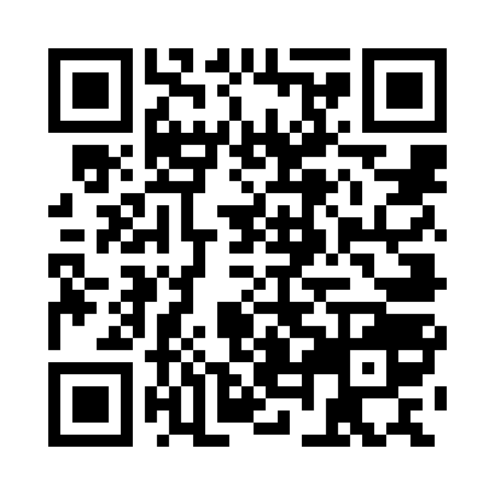
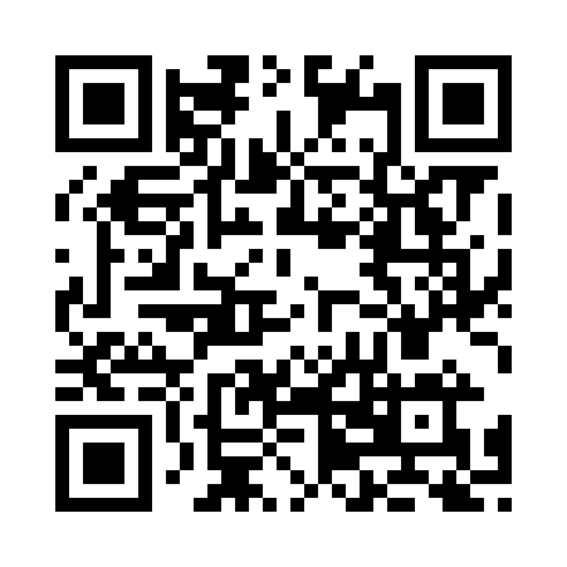

<p align="center">
  <a href="https://cybergems.org/apps/cybernotes/">
    
  </a>
</p>

<p align="center">
  <a href="https://github.com/CyberGems/CyberNotes/releases/latest"></a>
  &nbsp;<a href="https://github.com/CyberGems/CyberNotes/releases"></a>
</p>

<p align="center">
  &nbsp;
  &nbsp;
  &nbsp;
  <a href="https://github.com/CyberGems/CyberNotes/wiki"></a>
</p>

---

## What is CyberNotes?

CyberNotes is a sleek, privacy-focused note-taking application for Windows that keeps writing and organization entirely on your device. Create rich notes with formatting, images, code blocks, and markdown shortcuts; arrange them in colorful folders; work across multiple tabs; and detach important notes into floating windows. Instant search, autosave, session restore, customizable themes, and an optional master-password access lock support both quick ideas and longer projects. Data is stored locally with **SQL.js (SQLite WASM)**. Built with **Electron + React + TypeScript**.

*Free and open source (GPLv3): no ads, no tracking, and no data collection. Just enjoy it.*

---

## 🔒 Why CyberNotes?

Most note apps either sync your data to the cloud (privacy risk) or are too basic to be useful. CyberNotes gives you **the best of both worlds**: rich editing, powerful organization, and rock-solid security, all 100% offline.

| Need | Solution |
|---|---|
| Keep notes private | Local-only SQL.js: no cloud, no accounts, no tracking |
| Rich editing without bloat | TipTap editor with markdown shortcuts, images, code blocks |
| Stay organized | Folders with icons & colors, multi-tabs, floating notes, drag & drop |
| Protect sensitive notes | Master password (bcrypt-hashed access lock, notes stored unencrypted) with auto-lock and privacy shield |
| Work efficiently | Autosave, session restore, global hotkey, system tray |
| Make it yours | 6 themes, custom backgrounds, glass effects, UI scaling |

---

## ✨ Key Features

### ✍️ Rich Text Editing
- **TipTap Editor**: Bold, italic, underline, strikethrough, headings (H1–H3), bullet/ordered lists, code blocks, blockquotes, horizontal rules, text highlighting
- **Links & Images**: Auto-link detection, image insertion with size and alignment controls, local thumbnail previews
- **Markdown Shortcuts**: Type `##`, `>`, `-`, `` ``` `` for instant formatting
- **Document Tools**: Line/column counter, word/character count, reading time, document minimap, line numbers
- **Save Options**: Autosave as you type, manual save with draft protection, confirm on close/navigation

### 📁 Organization
- **Folders**: Custom names, 20 icon options, 20 unique colors (enforced uniqueness)
- **Floating Notes**: Detach notes as always-on-top desktop sticky widgets
- **Multi-Tab Interface**: Work with multiple notes simultaneously
- **Favorites & Pinning**: Pin important notes for quick access
- **Drag & Drop**: Move notes between folders effortlessly
- **Instant Search**: Full-text search across titles, previews, and content
- **Recent Notes**: Track edited, opened, and created notes with history
- **Welcome Space**: Time-based greeting, notes stats, and keyboard shortcuts when no note is open
- **Session Restoration**: Remember open tabs, active note, and floating notes between sessions

### 🔐 Security
- **Master Password**: Bcrypt-hashed access lock with lock screen (notes are stored unencrypted on your device)
- **Auto-Lock**: Configurable inactivity timeout (1 min to 24 hours)
- **Privacy Shield**: Screen shield when app is hidden or minimized
- **Caps Lock Manager**: Auto-off after inactivity with visual countdown and sound notifications (5 synthesized presets)

### 🎨 Customization
- **6 Visual Themes**: Cyber Dark, Midnight, Forest, Cyber Neon, Light, Graphite
- **Color Intensity**: Adjustable 0–100% for colorful themes
- **Custom Background**: Set your own wallpaper image
- **Glass Effects**: Configurable blur intensity (0–40px) and overlay opacity (0–95%)
- **UI Scaling**: Adjust interface size to your preference
- **Tab Width**: Normal or wide, minimap toggle, density controls
- **Greeting Name**: Personalize time-based greetings

### 🖥️ Desktop Integration
- **System Tray**: Minimize/close to tray, custom DPI-aware tray menu
- **Global Hotkey**: Show/hide with customizable shortcut (default: `Alt+Shift+N`)
- **Auto-Start**: Launch minimized with Windows
- **Single Instance**: Second launches focus the existing window
- **Spell Check**: Bilingual (English/Spanish) with right-click suggestions
- **Context Menu**: Formatting, spell suggestions, link/image controls

### 🔄 Updates & Data
- **Auto-Updates**: Background check on launch + every 6h, progress bar, auto-download and restart
- **Export**: Markdown, HTML (styled), or full JSON backup
- **Import**: Restore from JSON backup (with automatic safety backup)
- **Bilingual UI**: Full English / Español with instant switching

---

## 🛠️ Tech Stack & Architecture

- **Platform:** Windows 10 / 11
- **Framework:** Electron 35 + React 19 + TypeScript
- **Editor:** TipTap (ProseMirror)
- **Storage:** SQL.js (SQLite compiled to WebAssembly)
- **Security:** bcryptjs password hashing
- **Animations:** Motion (Framer Motion)
- **Testing:** Vitest unit tests (`npm test`)

```
cyber-notes/
├── electron/
│   ├── main.ts           Electron main process (window, tray, stickies, IPC handlers)
│   ├── preload.ts        Context bridge (secure API exposure)
│   ├── updater.ts        Auto-update logic
│   ├── logger.ts         File logger (userData/logs)
│   └── OpenTaskbarSettings.cs  Helper source for the tray pin tool
├── shared/               Code shared by main and renderer (no Electron/React APIs)
│   ├── notes.ts          Thumbnail extraction
│   ├── sticky.ts         Floating-note palette and ids
│   ├── lang.ts           Language helpers
│   └── backup.ts         Automatic backup logic (plus *.test.ts suites)
├── src/
│   ├── components/
│   │   ├── MainApp.tsx         Main application layout
│   │   ├── TitleBar.tsx        Custom title bar with menu and greeting
│   │   ├── Sidebar.tsx         Folder navigation and recent notes
│   │   ├── NoteList.tsx        Note list panel with search and trash
│   │   ├── NoteEditor.tsx      TipTap editor, tabs and export
│   │   ├── StickyNoteApp.tsx   Floating always-on-top note widget
│   │   ├── SettingsModal.tsx   Settings with backup configuration
│   │   ├── LockScreen.tsx      Password lock screen
│   │   ├── AboutModal.tsx      About dialog and update status
│   │   ├── UpdaterBanner.tsx   Auto-update progress banner
│   │   ├── TrayPinModal.tsx    Tray pin helper dialog
│   │   ├── AppLoader.tsx       Startup loader and privacy shield
│   │   ├── WelcomeGreeting.tsx Time-aware greeting with date
│   │   ├── WelcomeNameModal.tsx First-run name setup
│   │   ├── FolderIcon.tsx      Folder icons and colors
│   │   ├── ConfirmDialog.tsx   Reusable confirm/alert dialogs
│   │   ├── ModalActions.tsx    Shared modal motion and helpers
│   │   ├── Tooltip.tsx         Custom tooltips
│   │   ├── ErrorBoundary.tsx   Render crash fallback
│   │   └── GlobalErrorToast.tsx Global error toast
│   ├── hooks/
│   │   └── useInputContextMenu.tsx  Native-like input context menus
│   ├── utils/
│   │   ├── notes.ts      Note metadata, preview and thumbnail helpers
│   │   └── audio.ts      Synthesized Caps Lock sounds
│   ├── types/            TypeScript interfaces and API bridge types
│   ├── themes.ts         Theme definitions
│   ├── fonts.ts          Editor fonts
│   └── languages.ts      i18n translations (English / Español)
├── public/
│   ├── tray-menu.html/.js/.css  Custom tray menu window
│   └── fonts/            Self-hosted fonts (fully offline)
└── package.json
```

---

## 🚀 Getting Started

### Prerequisites

- [Node.js](https://nodejs.org/) v18+ (LTS recommended)
- npm or yarn

### Development

```bash
git clone https://github.com/CyberGems/CyberNotes.git
cd CyberNotes
npm install
npm run dev
```

### Build for Production

```bash
npm run build:electron
```

### Available Scripts

| Command | Description |
|---------|-------------|
| `npm run dev` | Start Vite development server with hot reload |
| `npm run build` | Compile TypeScript and build production bundle |
| `npm run build:electron` | Full build: TypeScript → Vite → electron-builder installer |
| `npm run preview` | Preview the production build locally |
| `npm run lint` | Run TypeScript type-checking without emitting files |
| `npm test` | Run unit tests with Vitest |

### Distribution

Artifacts land in `release/`:

| Artifact | Description |
|---|---|
| `CyberNotes_Setup_1.11.0.exe` | NSIS installer (interactive wizard, custom install dir) |
| `CyberNotes_Portable_1.11.0.exe` | Portable build (zero-install) |

### 🛡️ Windows SmartScreen

Windows may show a SmartScreen warning the first time you run the CyberNotes installer: this is an unsigned hobby app, so Windows hasn't built reputation for the file yet. This is expected; the source is public so you can inspect exactly what it does. The same can appear when launching the portable build.

To continue:

<details>
<summary><strong>See how to run the installer (step by step)</strong></summary>

Windows shows this warning for any installer without a paid code-signing certificate; it does not mean the file is unsafe. Do <strong>not</strong> click "Don't run":

1. Run the installer. Windows may show the blue "Windows protected your PC" dialog.


2. Click the small **More info** link.


3. Click **Run anyway**. The installer starts normally.

You can verify the file independently: compare the SHA with the GitHub release, scan it on VirusTotal, or build from source. More details: [SmartScreen guide on the website](https://cybergems.org/download#smartscreen).

</details>

---

## ⌨️ Keyboard Shortcuts

| Key | Action |
|---|---|
| `Alt+Shift+N` | Toggle window visibility (global, customizable) |
| `Ctrl+N` | Create a new note |
| `Ctrl+Shift+N` | Create a new folder |
| `Ctrl+F` | Focus search bar |
| `Ctrl+S` | Save note manually |
| `↑` / `↓` | Navigate notes in list |
| `Enter` | Open selected note in editor |
| `Escape` | Return focus to note list / close modal |
| `Ctrl+Z` / `Ctrl+Y` | Undo / Redo |
| `Tab` / `Shift+Tab` | Indent / Remove indent |

For the complete shortcuts reference including cursor navigation, line jumps, and text selection keys, see the [Keyboard Shortcuts Wiki](https://github.com/CyberGems/CyberNotes/wiki/Keyboard-Shortcuts).

---

## ❤️ Donate

After countless hours building and refining **CyberNotes** for my own use, I recently decided to share it with the world along with my other open-source tools in [CyberGems](https://github.com/CyberGems#-all-apps--repositories).

If you’d like to support future updates, I’d truly appreciate it. Your donation helps keep development going, roll out new features, speed up updates and bug resolution, and enhance documentation quality. You can also show your support by [starring the repo on GitHub](https://github.com/CyberGems/CyberNotes). Thank you! 🙏

<p align="center">
  <a href="https://www.paypal.com/donate/?hosted_button_id=M4PY3UPJA5Y6Q"></a>
</p>

<p align="center">
  <a href="https://ko-fi.com/cybergems"></a>
</p>

<p align="center">
  <a href="https://buymeacoffee.com/cybergems"></a>
</p>

<div align="center">

<details>
<summary><b>Crypto donations (BTC, ETH, USDT, LTC): click to view addresses</b></summary>

| Asset | Address | QR |
|---|---|---|
| **BTC** | <pre><code>bc1q5mxzz05nmvsheqzx7970euswta3fksxzcfzag4</code></pre> |  |
| **ETH** | <pre><code>0x79b703Ec0f77493679Fcd280aF3b983E20c580B8</code></pre> |  |
| **USDT (ERC20 / BEP20)** | <pre><code>0x79b703Ec0f77493679Fcd280aF3b983E20c580B8</code></pre> |  |
| **USDT (TRC20)** | <pre><code>TSVbSk1HSyZ1NprCnAYiw56ECwXgH887mD</code></pre> |  |
| **LTC** | <pre><code>LWGnEHgcFCE2BRkzLnsdPDD8Y8ZeDK577X</code></pre> |  |

> ⚠️ Send only the selected asset on the indicated network. Using the wrong network will result in permanent loss of funds.

</details>

</div>

---

## 📄 License

CyberNotes is distributed under the terms of the GNU General Public License v3.0. See [LICENSE](LICENSE) for the full license text.

Copyright (C) 2026 CyberGems

---

## ❓ FAQ

For frequently asked questions, troubleshooting guides, and detailed configuration instructions, visit the [FAQ](https://github.com/CyberGems/CyberNotes/wiki/FAQ) or the [online documentation](https://cybergems.org/docs/cybernotes/FAQ).

> Documentation source of truth: the [GitHub Wiki](https://github.com/CyberGems/CyberNotes/wiki) is canonical (edited via the `CyberNotes.wiki` checkout). The website mirrors it.

---

<div align="center" style="background:#0D0F17; border:1px solid rgba(0,255,255,0.12); border-radius:12px; padding:28px 20px; margin-top:32px;">

### Thanks for using CyberNotes! 🎉

Made by [**CyberGems**](https://cybergems.org)

</div>
<p align="center">
  <a href="https://www.reddit.com/submit?url=https%3A%2F%2Fcybergems.org%2Fapps%2Fcybernotes%2F&title=CyberNotes%3A%20free%20%26%20open-source%20desktop%20tool%20for%20Windows"></a>
  &nbsp;<a href="https://twitter.com/intent/tweet?text=CyberNotes%3A%20free%20%26%20open-source%20desktop%20tool%20for%20Windows&url=https%3A%2F%2Fcybergems.org%2Fapps%2Fcybernotes%2F"></a>
  &nbsp;<a href="https://www.facebook.com/sharer/sharer.php?u=https%3A%2F%2Fcybergems.org%2Fapps%2Fcybernotes%2F"></a>
  &nbsp;<a href="mailto:?subject=CyberNotes%3A%20free%20%26%20open-source%20desktop%20tool%20for%20Windows&body=CyberNotes%3A%20free%20%26%20open-source%20desktop%20tool%20for%20Windows%20https%3A%2F%2Fcybergems.org%2Fapps%2Fcybernotes%2F"></a>
  &nbsp;<a href="https://t.me/share/url?url=https%3A%2F%2Fcybergems.org%2Fapps%2Fcybernotes%2F&text=CyberNotes%3A%20free%20%26%20open-source%20desktop%20tool%20for%20Windows"></a>
  &nbsp;<a href="https://www.linkedin.com/sharing/share-offsite/?url=https%3A%2F%2Fcybergems.org%2Fapps%2Fcybernotes%2F"></a>
</p>

---

## 🔗 See also

More free, open-source, privacy-first apps from [**CyberGems**](https://github.com/CyberGems):

| App | Description |
|:---:|---|
| 🕐&nbsp;[**CyberClock**](https://github.com/CyberGems/CyberClock#readme) | Desktop clock with analog & digital display, calendar, timer, stopwatch and relaxation module. |
| 📢&nbsp;[**CyberFeeds**](https://github.com/CyberGems/CyberFeeds#readme) | High-performance, local-first RSS and Atom reader built for speed, privacy and clean reading. |
| 🚀&nbsp;[**CyberLauncher**](https://github.com/CyberGems/CyberLauncher#readme) | Windows application launcher with hot corners, scheduler, system monitor and integrated terminal. |
| 💻&nbsp;[**CyberManager**](https://github.com/CyberGems/CyberManager#readme) | Lightweight, high-performance task manager, virtualized and NT-native, a powerful Task Manager alternative. |
| ⚡&nbsp;[**CyberPaste**](https://github.com/CyberGems/CyberPaste#readme) | Privacy-first clipboard manager for text, code, images, HTML and files. |
| 📸&nbsp;[**CyberSnap**](https://github.com/CyberGems/CyberSnap#readme) | Screen capture and annotation suite with vector tools, high-speed OCR, screen recording and color picker. |
| ⭐&nbsp;[**CyberTray**](https://github.com/CyberGems/CyberTray#readme) | High-performance tray launcher with hotspots, system monitoring, process manager and PIN-protected file vault. |
| 💫&nbsp;[**CyberViewer**](https://github.com/CyberGems/CyberViewer#readme) | Full-featured image viewer and editor engineered for casual and power users. |
| 🛡️&nbsp;[**CyberWall**](https://github.com/CyberGems/CyberWall#readme) | User-friendly Windows firewall with real-time per-app rules powered by the WFP kernel engine. |

➡️ **[Browse all apps at cybergems.org](https://cybergems.org)**
